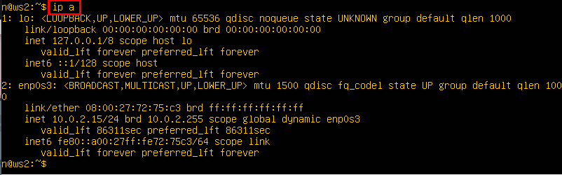
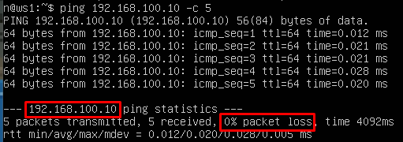
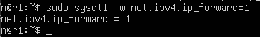
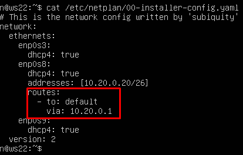

Оглавление:

[[_TOC_]]

## Part 1. Инструменты _ipcalc_

### 1.1 Сети и маски

1. Определить адрес сети 192.167.38.54/13

Используем следующую команду:


_Вывод команды ipcalc 192.167.38.54/13_

2. Определить перевод маски 255.255.255.0 в префиксную и двоичную запись, /15 в обычную и двоичную, 11111111.11111111.11111111.11110000 в обычную и префиксную

- 255.255.255.0

Используем следующую команду:


_Вывод команды ipcalc 255.255.255.0. Сверху изображена двоичная запись, а чуть ниже - префиксная_

- 15


_Вывод команды ipcalc /15_

- 11111111.11111111.11111111.11110000

У нас не получится использовать предыдущую команду, поскольку она не поддерживает ввод двоичных чисел. Поэтому можем вспомнить, что 255.255.255.0 имеет префиксную запись /24. Значит наше число будет иметь префиксную запись 28. Проверяем:


_Вывод команды ipcalc /28. Сверху - префиксная форма, чуть ниже обычная и двоичная соответственно_


3. Определить минимальный и максимальный хост в сети 12.167.38.4 при масках: /8, 11111111.11111111.00000000.00000000, 255.255.254.0 и /4

- /8

Опять используем эту же команду:


_Вывод команды ipcalc 12.167.38.4/8_

- 11111111.11111111.00000000.00000000

Для этого числа маска равна 16:


_Вывод команды ipcalc 12.167.38.4/16_

- 255.255.254.0

У этого маска равна 24 - 1 = 23:


_Вывод команды ipcalc 12.167.38.4/23_

- /4


_Вывод команды ipcalc 12.167.38.4/4_

### 1.2 _localhost_

- Определить, можно ли обратиться к приложению, работающему на localhost, со следующими IP: 194.34.23.100, 127.0.0.2, 127.1.0.1, 128.0.0.1

_Localhost_ имеет диапазон 127.0.0.1 — 127.255.255.254, поэтому можно обратиться к приложениям 127.0.0.2, 127.1.0.1.

### 1.3 Диапазоны и сегменты сетей

1. Определить, какие из перечисленных IP можно использовать в качестве публичного, а какие только в качестве частных: 10.0.0.45, 134.43.0.2, 192.168.4.2, 172.20.250.4, 172.0.2.1, 192.172.0.1, 172.68.0.2, 172.16.255.255, 10.10.10.10, 192.169.168.1

К частным IP адресам относятся диапазоны:

- 10.0.0.0 — 10.255.255.255
- 100.64.0.0 — 100.127.255.255
- 172.16.0.0 — 172.31.255.255
- 192.168.0.0 — 192.168.255.255

Соответственно, публичные адреаса:

- 134.43.0.2
- 172.0.2.1
- 192.172.0.1
- 172.68.0.2
- 192.169.168.1

Частные:

- 10.0.0.45
- 192.168.4.2
- 172.20.250.4
- 172.16.255.255
- 10.10.10.10

2) Опрелелить, какие из перечисленных IP адресов шлюза возможны у сети 10.10.0.0/18: 10.0.0.1, 10.10.0.2, 10.10.10.10, 10.10.100.1, 10.10.1.255

Используем команду:


_Вывод команды ipcalc 10.10.0.0/18_

В полученном выводе мы видим, что возможны адреса от 10.10.0.1 до 10.10.63.254. Им соответствуют: 10.10.0.2, 10.10.10.10, 10.10.1.255.


## Part 2. Статическая маршрутизация между двумя машинами

- С помощью команды ip a посмотреть существующие сетевые интерфейсы


_Вывод команды ip a для первой машины_



_Вывод команды ip a для второй машины_

- Описать сетевой интерфейс, соответствующий внутренней сети, на обеих машинах и задать следующие адреса и маски: ws1 - 192.168.100.10, маска /16, ws2 - 172.24.116.8, маска /12.


_Вывод команды cat etc/netplan/00-installer-config.yaml для первой машины_


_Вывод команды cat etc/netplan/00-installer-config.yaml для второй машины_

Выполним команды _netplan apply_ и _ip a_ для применения и демонстрации изменений:


_Вывод команды ip a для первой машины_


_Вывод команды ip a для второй машины_

### 2.1 Добавление статического маршрута вручную

- Добавить статический маршрут от одной машины до другой и обратно при помощи команды вида _ip r add_

- Пропинговать соединение между машинами



_Вывод команды ping 172.24.116.8 -c 5 для первой машины_


_Вывод команды ping 192.168.100.10 -c 5 для второй машины_


### 2.2 Добавление статического маршрута с сохранением

- Перезапустить машины

- Добавить статический маршрут от одной машины до другой с помощью файла _etc/netplan/00-installer-config.yaml_


_Вывод команды cat etc/netplan/00-installer-config.yaml для первой машины_


_Вывод команды cat etc/netplan/00-installer-config.yaml для второй машины_

- Пропинговать соединение между машинами


_Вывод команды ping 172.24.116.8 -c 5 для первой машины_


_Вывод команды ping 192.168.100.10 -c 5 для второй машины_

## Part 3. Утилита _iperf3_

### 3.1. Скорость соединения

- Перевести и записать в отчёт: 8 _Mbps_ в _MB/s_, 100 _MB/s_ в _Kbps_, 1 _Gbps_ в _Mbps_

```
8 Mbps = 1 MB/s
100 MB/s = 800000 Kbps
1 Gbps = 1000 Mbps
```

### 3.2. Утилита _iperf3_

- Измерить скорость соединения между _ws1_ и _ws2_


_Вывод команды ipref3 -s для первой машины_


_Вывод команды ipref3 -s 192.168.100.10 для второй машины_

## Part 4. Сетевой экран

### 4.1. Утилита _iptables_

- Создать файл _/etc/firewall.sh_, имитирующий фаерволл, на _ws1_ и _ws2_:

``` shell
#!/bin/sh

# Удаление всех правил в таблице "filter" (по-умолчанию).
iptables –F
iptables -X
```

- Нужно добавить в файл подряд следующие правила:

1) на _ws1_ применить стратегию когда в начале пишется запрещающее правило, а в конце пишется разрешающее правило (это касается пунктов 4 и 5)

2) на _ws2_ применить стратегию когда в начале пишется разрешающее правило, а в конце пишется запрещающее правило (это касается пунктов 4 и 5)

3) открыть на машинах доступ для порта 22 (_ssh_) и порта 80 (_http_)

4) запретить _echo reply_ (машина не должна "пинговаться”, т.е. должна быть блокировка на _OUTPUT_)

5) разрешить _echo reply_ (машина должна "пинговаться")


_Вывод команды cat /etc/firewall.sh для первой машины_


_Вывод команды cat /etc/firewall.sh для второй машины_

- Запустить файлы на обеих машинах командами _chmod +x /etc/firewall.sh_ и _/etc/firewall.sh_


_Вывод команды /etc/firewall.sh для первой машины_


_Вывод команды /etc/firewall.sh для второй машины_

```
При построении правил в iptables важна очередность команд. Флаг -А добавляет правило в конец очереди.
Мы написали такие правила, что на ws1 все входящие пакеты отклоняются, а на ws2 принимаются.
Это можно проверить, пропинговав lo на каждой машине.
```

### 4.2. Утилита _nmap_

- Командой _ping_ найти машину, которая не "пингуется", после чего утилитой _nmap_ показать, что хост машины запущен


_Вывод команды ping 127.0.0.1 для первой машины_


_Вывод команды ping 127.0.0.1 для второй машины_


_Вывод команды nmap 192.168.100.10 для первой машины_

- Сохранить дампы образов виртуальных машин

## Part 5. Статическая маршрутизация сети


_Сеть_

- Поднять пять виртуальных машин (3 рабочие станции (_ws11, ws21, ws22_) и 2 роутера (_r1, r2_))

### 5.1. Настройка адресов машин

- Настроить конфигурации машин в _etc/netplan/00-installer-config.yaml_ согласно сети на рисунке.


_Вывод команды cat etc/netplan/00-installer-config.yaml для машины ws11_


_Вывод команды cat etc/netplan/00-installer-config.yaml для машины ws21_


_Вывод команды cat etc/netplan/00-installer-config.yaml для машины ws22_


_Вывод команды cat etc/netplan/00-installer-config.yaml для машины r1_


_Вывод команды cat etc/netplan/00-installer-config.yaml для машины r2_

- Перезапустить сервис сети. Если ошибок нет, то командой _ip -4 a_ проверить, что адрес машины задан верно. Также пропинговать _ws22_ с _ws21_. Аналогично пропинговать _r1_ с _ws11_.


_Вывод команды ip -4 a для машины ws11_


_Вывод команды ip -4 a для машины ws21_


_Вывод команды ip -4 a для машины ws22_


_Вывод команды ip -4 a для машины r1_


_Вывод команды ip -4 a для машины r2_


_Вывод команды ping 10.10.0.1 a для машины w11_


_Вывод команды ping 10.20.0.20 a для машины w21_

### 5.2. Включение переадресации _IP_-адресов

- Для включения переадресации IP, выполните команду на роутерах: _sysctl -w net.ipv4.ip_forward=1_.



_Вывод команды sysctl -w net.ipv4.ip_forward=1 для машины r1_


_Вывод команды sysctl -w net.ipv4.ip_forward=1 для машины r2_

- Откройте файл /etc/sysctl.conf и добавьте в него следующую строку: _net.ipv4.ip_forward = 1_


_Вывод команды sudo nano /etc/sysctl.conf для машины r1_


_Вывод команды sudo nano /etc/sysctl.confдля машины r2_

### 5.3. Установка маршрута по-умолчанию

- Настроить маршрут по-умолчанию (шлюз) для рабочих станций. Для этого добавить _default_ перед _IP_ роутера в файле конфигураций


_Вывод команды cat etc/netplan/00-installer-config.yaml для машины ws11_


_Вывод команды cat etc/netplan/00-installer-config.yaml для машины ws21_



_Вывод команды cat etc/netplan/00-installer-config.yaml для машины ws22_

- Вызвать _ip r_ и показать, что добавился маршрут в таблицу маршрутизации


_Вывод команды ip r для машины ws11_


_Вывод команды ip r для машины ws21_


_Вывод команды ip r для машины ws22_

- Пропинговать с ws11 роутер r2 и показать на r2, что пинг доходит. Для этого использовать команду: _tcpdump -tn -i eth1_


_Вывод команды ping 10.100.0.10 для машины ws1_


_Вывод команды tcpdump -tn -i enp0s8 для машины r1_

### 5.4. Добавление статических маршрутов

- Добавить в роутеры _r1_ и _r2_ статические маршруты в файле конфигураций


_Вывод команды cat etc/netplan/00-installer-config.yaml для машины r1_


_Вывод команды cat etc/netplan/00-installer-config.yaml для машины r2_

- Вызвать _ip r_ и показать таблицы с маршрутами на обоих роутерахip


_Вывод команды ip r для машины r1_


_Вывод команды ip r для машины r2_

- Запустить команды на ws11: _ip r list 10.10.0.0/[маска сети]_ и _ip r list 0.0.0.0/0_


_Вывод команды ip r list 10.10.0.0/18 и ip r list 0.0.0.0/0 для машины ws11_

```
Маршрут по умолчанию имеет меньшую приоритетность. Поэтому для адреса 10.10.0.0/18
был выбран маршрут, отличный от 0.0.0.0/0.
```

### 5.5. Построение списка маршрутизаторов

- Запустить на r1 команду дампа: _tcpdump -tnv -i eth0_


_Вывод команды tcpdump -tnv -i enp0s8 для машины r1_

- При помощи утилиты _traceroute_ построить список маршрутизаторов на пути от ws11 до ws21


_Вывод команды traceroute 10.20.0.10 для машины ws11_

```
Для доставки пакета от исходного узла ws11 с ip-адресом 10.10.0.2 к конечному узлу ws21 с ip-адресом 10.20.0.10
необходимо пройти несколько этапов. Сначала пакет направляется к шлюзу с ip-адресом 10.10.0.1.
Затем пересылается на шлюз 10.100.0.12, который, в свою очередь, направляет его в целевую подсеть 10.20.0.0/26.
Важно отметить, что каждый пакет, отправленный в сети, проходит через определенное количество узлов прежде
чем достигнет своей конечной цели.

Каждый пакет имеет свое время жизни. Это количество узлов, которые может пройти пакет перед тем,
как он будет уничтожен. Этот параметр записывается в заголовке TTL, каждый маршрутизатор,
через который будет проходить пакет уменьшает его на единицу. При TTL=0 пакет уничтожается,
а отправителю отсылается сообщение Time Exceeded.

Команда traceroute linux использует UDP пакеты. Она отправляет пакет с TTL=1 и смотрит адрес ответившего
узла, дальше TTL=2, TTL=3 и так пока не достигнет цели. Каждый раз отправляется по три пакета
и для каждого из них измеряется время прохождения. Пакет отправляется на случайный порт, который,
скорее всего, не занят. Когда утилита traceroute получает сообщение от целевого узла о том, что порт
недоступен трассировка считается завершенной.
```

### 5.6. Использование протокола _ICMP_ при маршрутизации

- Запустить на _r1_ перехват сетевого трафика, проходящего через _eth0_ с помощью команды: _tcpdump -n -i eth0 icmp_

- Пропинговать с _ws11_ несуществующий _IP_ (например, 10.30.0.111) с помощью команды: _ping -c 1 10.30.0.111_


_Вывод команды ping -c 1 10.30.0.111 для машины w11_


_Вывод команды tcpdump -n -i enp0s8 icmp для машины r1_

- Сохранить дампы образов виртуальных машин

## Part 6. Динамическая настройка _IP_ с помощью _DHCP_

- Для _r2_ настроить в файле _/etc/dhcp/dhcpd.conf_ конфигурацию службы _DHCP_:

1) указать адрес маршрутизатора по-умолчанию, _DNS_-сервер и адрес внутренней сети


_Вывод команды nano /etc/dhcp/dhcpd.conf для машины r2_

2) в файле _resolv.conf_ прописать _nameserver 8.8.8.8_


_Вывод команды nano /etc/resolv.conf для машины r2_

- Перезагрузить службу _DHCP_ командой _systemctl restart isc-dhcp-server_. Машину _ws21_ перезагрузить при помощи _reboot_ и через _ip a_ показать, что она получила адрес. Также пропинговать _ws22_ с _ws21_


_Вывод команды nano systemctl restart isc-dhcp-server для машины r2_


_Вывод команды ip a для машины w21_


_Вывод команды ping 10.20.0.20 для машины w21_

- Указать _MAC_ адрес у _ws11_, для этого в _etc/netplan/00-installer-config.yaml_ надо добавить строки: _macaddress: 10:10:10:10:10:BA, dhcp4: true_


_Вывод команды nanoetc/netplan/00-installer-config.yaml для машины ws11_

- Для _r1_ настроить аналогично _r2_, но сделать выдачу адресов с жесткой привязкой к _MAC_-адресу (_ws11_). Провести аналогичные тесты

```
Для начала изменим /etc/dhcp/dhcpd.conf.
```


_Вывод команды nano /etc/dhcp/dhcpd.conf для машины r1_

```
В файле resolv.conf пропишем nameserver 8.8.8.8.
```


_Вывод команды nano /etc/resolv.conf для машины r1_

```
Перезагрузим службу DHCP командой systemctl restart isc-dhcp-server.
```


_Вывод команды nano systemctl restart isc-dhcp-server для машины r1_


_Вывод команды ip a для машины w11_


_Вывод команды ping 10.20.0.20 для машины w11_

- Запросить с _ws21_ обновление _ip_ адреса


_Вывод команды ip a для машины w21_

```
Это сетевая конфигурация до обновления ip адреса. Теперь выполним команды sudo dhclient -r enp0s8
и sudo dhclient enp0s8. Проверяем сетевую конфигурацию снова.
```


_Вывод команды ip a для машины w21_

```
Новый ip - 192.168.1.85/24.
```

- Сохранить дампы образов виртуальных машин

## Part 7. _NAT_

- В файле _/etc/apache2/ports.conf_ на _ws22_ и _r1_ изменить строку _Listen 80_ на _Listen 0.0.0.0:80_, то есть сделать сервер _Apache2_ общедоступным


_Вывод команды nano /etc/apache2/ports.conf для машины w22_


_Вывод команды nano /etc/apache2/ports.conf для машины r1_

- Запустить веб-сервер _Apache_ командой _service apache2 start_ на _ws22_ и _r1_


_Вывод команды service apache2 start для машины w22_


_Вывод команды nano service apache2 start для машины r1_

- Добавить в фаервол, созданный по аналогии с фаерволом из Части 4, на _r2_ следующие правила:

1) удаление правил в таблице _filter - iptables -F_

2) удаление правил в таблице _"NAT" - iptables -F -t nat_

3) отбрасывать все маршрутизируемые пакеты - _iptables --policy FORWARD DROP_

- Запускать файл также, как в Части 4


_Вывод команд для создания и запуска фаервола для машины r2_

- Проверить соединение между _ws22_ и _r1_ командой _ping_


_Вывод команды ping 10.20.0.20 для машины r1_

- Добавить в файл ещё одно правило:

4) разрешить маршрутизацию всех пакетов протокола _ICMP_

- Запускать файл также, как в Части 4


_Вывод команд для настройки и запуска фаервола для машины r2_

- Проверить соединение между _ws22_ и _r1_ командой _ping_


_Вывод команды ping 10.20.0.20 для машины r1_

- Добавить в файл ещё два правила:

5) включить _SNAT_, а именно маскирование всех локальных _ip_ из локальной сети, находящейся за _r2_ (по обозначениям из Части 5 - сеть 10.20.0.0)

6) включить _DNAT_ на 8080 порт машины _r2_ и добавить к веб-серверу _Apache_, запущенному на _ws22_, доступ извне сети

- Запускать файл также, как в Части 4


_Вывод команд для настройки и запуска фаервола для машины r2_

- Проверить соединение по _TCP_ для _SNAT_, для этого с _ws22_ подключиться к серверу _Apache_ на _r1_ командой: _telnet [адрес] [порт]_


_Вывод команды telnet 10.100.0.11 80 для машины ws2_

- Проверить соединение по _TCP_ для _DNAT_, для этого с _r1_ подключиться к серверу _Apache_ на _ws22_ командой _telnet_ (обращаться по адресу _r2_ и порту 8080)


_Вывод команды telnet 10.20.0.20 80 для машины r1_

- Сохранить дампы образов виртуальных машин

## Part 8. Дополнительно. Знакомство с _SSH Tunnels_

- Запустить на r2 фаервол с правилами из Части 7

- Запустить веб-сервер _Apache_ на _ws22_ только на _localhost_ (то есть в файле _/etc/apache2/ports.conf_ изменить строку _Listen 80_ на _Listen localhost:80_)


_Вывод команды nano /etc/apache2/ports.conf для машины w22_


_Вывод команды service apache2 start для машины w22_

- Воспользоваться _Local TCP forwarding_ с _ws21_ до _ws22_, чтобы получить доступ к веб-серверу на _ws22_ с _ws21_


_Вывод команды ssh -L 8080:localhost:80 w22@10.20.0.20 для машины w21_

- Воспользоваться _Remote TCP forwarding_ c _ws11_ до _ws22_, чтобы получить доступ к веб-серверу на _ws22_ с _ws11_


_Вывод команды ssh -R 8080:localhost:80 w22@10.20.0.20 для машины w21_

- Для проверки, сработало ли подключение в обоих предыдущих пунктах, перейдите во второй терминал и выполните команду: _telnet 127.0.0.1 [локальный порт]_


_Вывод команды telnet localhost 80 для машины w21_


_Вывод команды telnet localhost 80 для машины w11_

- Сохранить дампы образов виртуальных машин
